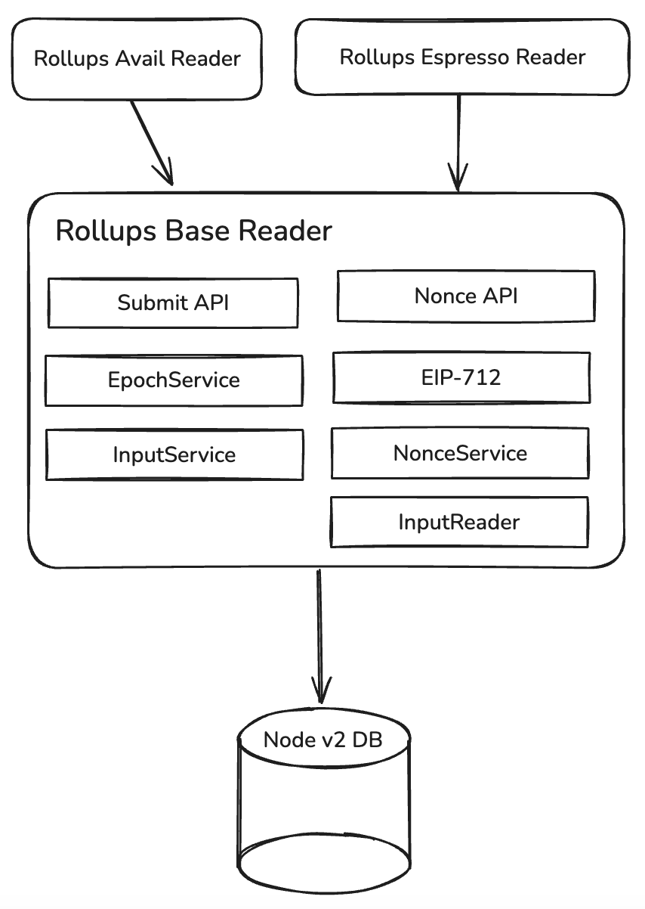

# Rollups Base Reader

## Spec notes

- `input.transaction_reference`:  
  - When the input comes from the base layer, the value **must be the index from the ABI encoded value**.  
  - When the input comes from `/submit`, the value **must be the hash returned by the API**.
